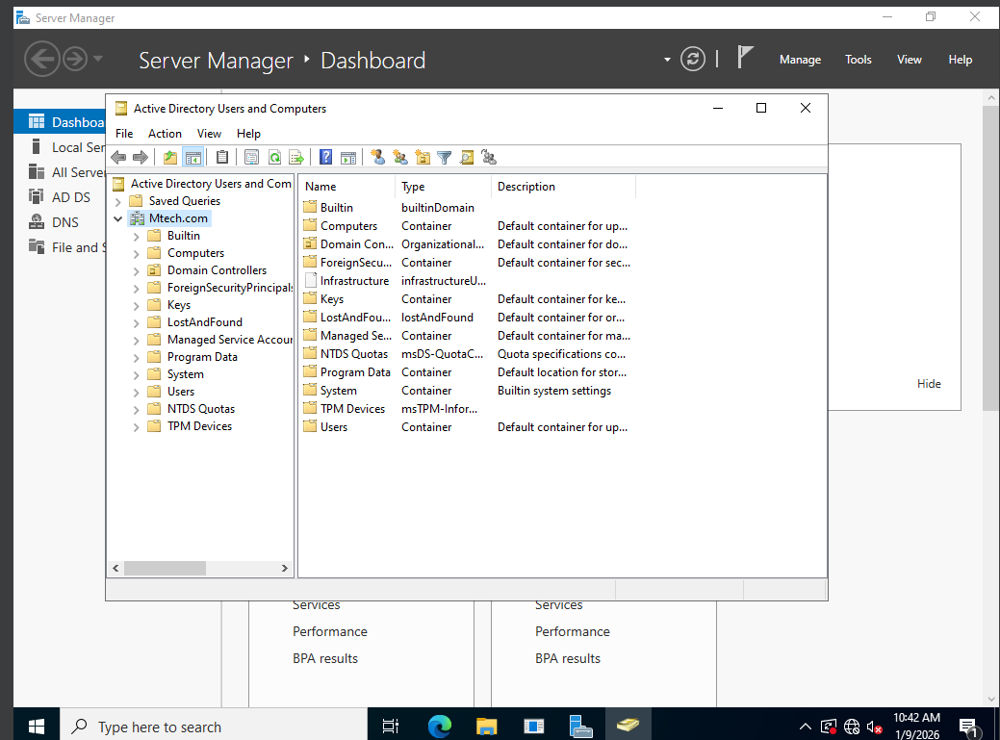

<h1>Active Directory & Windows Server 2022 Security Lab</h1>

<h2>Description</h2>
This project demonstrates the deployment, configuration, and validation of a Windows Server 2022 Domain Controller within a controlled virtualized lab environment. The objective was to simulate enterprise identity and access management using Active Directory Domain Services (AD DS), implement Group Policy Objects (GPOs), and validate policy enforcement through administrative tools.

The lab consists of two virtual machines connected via an isolated VirtualBox network:

- Windows Server 2022 (Domain Controller) - 192.168.30.10
- Windows 10 (Domain-Joined Client) - 192.168.30.20

The objective was to:
- Install and configure Active Directory Domain Services
- Promote a server to Domain Controller
- Create Organizational Units (OUs), users, and security groups
- Implement and link custom Group Policy Objects (GPOs)
- Enforce password and account lockout policies
- Validate policy application using gpresult
- Troubleshoot DNS and domain join connectivity issues

This project demonstrates hands-on Windows system administration, identity and access management, infrastructure troubleshooting, and security policy enforcement in an enterprise-style environment.

 

<h2>Technologies and Utilities Used</h2>

- <b>Windows Server 2022</b>
- <b>Windows 10</b>
- <b>Active Directory Domain Services (AD DS)</b>
- <b>Group Policy Management Console (GPMC)</b>
- <b>DNS</b>
- <b>gpresult (Policy Validation)</b>
- <b>VirtualBox Internal Networking</b>

 

<h2>Lab Environment</h2>

- <b>Windows Server 2022 VM</b> (Domain Controller)
- <b>Windows 10 VM</b> (Domain-Joined Client)
- <b>Internal Network (ADLAB)</b>
- <b>Domain:</b> Mtech.com

 

<h2>Lab Architecture</h2>

Windows 10 (Client) → Authentication → Domain Controller (192.168.30.10)
 
 

 

<h2>User & Group Management</h2>

Created structured Organizational Units (OUs) and implemented role-based access controls.

 

<h2>Default Domain Policy Review</h2>

Verified Default Domain Policy linkage and enforcement at the domain level.

 

<h2>Custom Group Policy Object (GPO)</h2>

Created and linked a custom GPO (Test_user_restrictions) to the Test_Users OU to enforce security controls.

 

<h2>Policy Validation (gpresult)</h2>

Validated successful GPO application using gpresult.

Confirmed:
- Test_user_restrictions GPO applied
- Domain Controller source verified
- Security group membership validated

 

<h2>Key Outcomes</h2>

- Successfully deployed and configured a functional Domain Controller
- Implemented enterprise-style identity and access controls
- Created and enforced custom Group Policy Objects
- Validated policy application using administrative command-line tools
- Practiced infrastructure troubleshooting and security hardening

 

<h2>Author</h2>

Matthew Hizine  
M.S. Cybersecurity  
Aspiring SOC / Infrastructure Security Analyst  
Atlanta, GA
